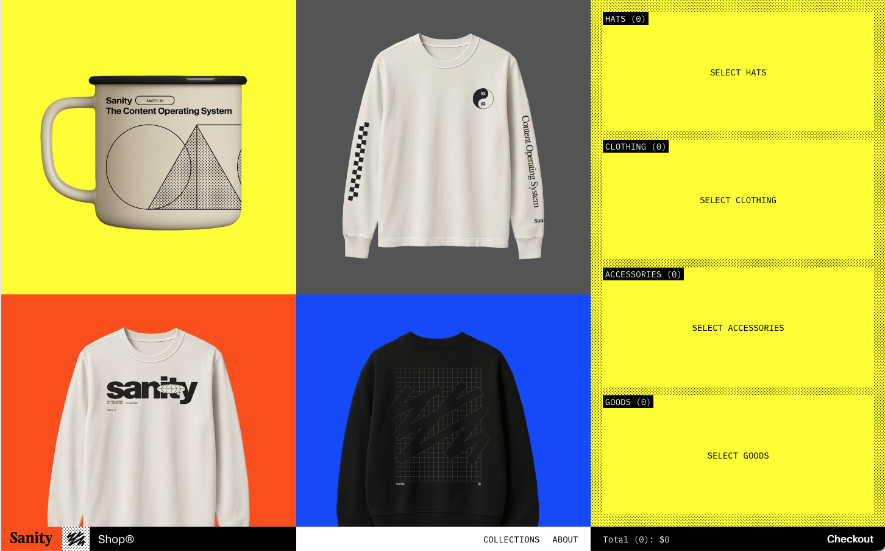
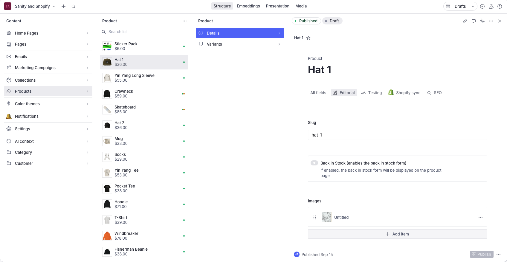

# [Sanity Market](https://sanity.market) - E-Commerce Monorepo

 > **This is Running Live in Production:** Built with **Sanity**, **Shopify Hydrogen**, **Sanity Functions**, and **Sanity SDK Apps**. This monorepo provides a complete headless commerce solution with advanced content management, real-time notifications, attribution tracking, and automated marketing campaigns.


View the live [Sanity Market](https://sanity.market)

## 🏗️ Architecture Overview

This repository contains multiple interconnected systems:

- **🌐 Frontend**: React Router-based Hydrogen storefront
- **📝 Studio/CMS**: Sanity Studio for content management
- **⚡ Functions**: Serverless functions for automation
- **📱 Apps**: Custom Sanity SDK applications
- **🔄 Integrations**: Shopify, Algolia, and Klaviyo

## 📁 Repository Structure

```
swag-store/
├── web/                          # Hydrogen storefront (React Router)
├── sanity/                       # Sanity Studio CMS
├── functions/                    # Sanity Functions (serverless)
├── sanity-apps/                  # Custom Sanity SDK Apps
│   ├── notifications/            # Notification management app
│   └── attribution/              # Attribution tracking app
├── data/                         # Sample data and fixtures
└── docs/                         # Documentation and guides
```

## 🚀 Quick Start

### Prerequisites

- **Node.js** 18+ (required by Hydrogen)
- **pnpm** 10.12.4+ (package manager)
- **Shopify CLI** ~3.85.4 (for Hydrogen development)
- **Sanity CLI** (for CMS management)
- **TypeScript** 5.2.2+ (for type checking)

### Installation

1. **Clone the repository**
   ```bash
   git clone <repository-url>
   cd swag-store
   ```

2. **Install dependencies**
   ```bash
   pnpm install
   ```

3. **Set up environment variables**
   ```bash
   # Copy environment templates
   cp web/.env.example web/.env
   cp sanity/.env.example sanity/.env
   ```

4. **Configure your environment**
   - Update `web/.env` with Shopify credentials
   - Update `sanity/.env` with Sanity project details
   - Configure function environment variables

### Development

Start all services in development mode:

```bash
# Start everything (web + sanity + functions)
pnpm dev

# Or start individual services
pnpm dev:web      # Hydrogen storefront (with codegen)
pnpm dev:sanity   # Sanity Studio

# Additional development commands
pnpm typecheck    # Run TypeScript type checking
pnpm lint         # Run ESLint
pnpm codegen      # Generate GraphQL types and Sanity types
```

## 🌐 Frontend (Hydrogen Storefront)

**Location**: `web/`

A modern e-commerce storefront built with Shopify Hydrogen and React Router v7.

### Features

- **🛍️ Product Catalog**: Dynamic product listings and collections
- **🌍 Internationalization**: Multi-language and multi-currency support
- **📱 Responsive Design**: Mobile-first responsive layout
- **⚡ Performance**: Optimized for Core Web Vitals
- **🎨 Custom Components**: Reusable UI components and layouts

### Tech Stack

- **Framework**: Shopify Hydrogen 2025.7.0
- **Routing**: React Router 7.9.2 (file-based routing)
- **Styling**: Tailwind CSS 4.1.6
- **State Management**: React Context + Hooks
- **Data Fetching**: GraphQL + GROQ queries
- **React**: 18.3.1
- **TypeScript**: 5.2.2

### Key Routes (File-based Routing)

The application uses React Router v7's file-based routing system with locale support:

- `($locale)._index.tsx` - Homepage with featured content
- `($locale).products.$handle.tsx` - Product detail pages
- `($locale).collections.$handle.tsx` - Collection pages
- `($locale).collections._index.tsx` - Collections listing
- `($locale).collections.all.tsx` - All products page
- `($locale).pages.$handle.tsx` - CMS-managed pages
- `($locale).cart.tsx` - Shopping cart
- `($locale).cart.$lines.tsx` - Cart line items
- `($locale).policies.$handle.tsx` - Policy pages
- `($locale).newsletter.ts` - Newsletter subscription
- `($locale).subscribe.tsx` - Subscription management
- `($locale).discount.$code.tsx` - Discount code handling
- `[robots.txt].tsx` - SEO robots file
- `api.preview.ts` - Sanity preview API

## 📝 CMS (Sanity Studio)



**Location**: `sanity/`

A powerful content management system with custom schemas and workflows built with Sanity v4.10.1.

### Content Types

- **Products**: Shopify-synced product data
- **Collections**: Product groupings and categories
- **Pages**: Custom CMS pages and content
- **Emails**: Craft marketing campaigns for Klaviyo
- **Marketing Campaigns**: Campaign management
- **Notifications**: System notifications
- **Settings**: Site-wide configuration

### Custom Features

- **🔄 Shopify Sync**: Automatic product synchronization
- **📊 Analytics**: Built-in content analytics with Sanity Assist
- **🎯 Hotspots**: Interactive image hotspots with custom plugin
- **📱 Preview**: Live preview of content
- **🔧 Custom Actions**: Automated content workflows
- **🤖 AI Assist**: Content generation and optimization
- **📸 Media Management**: Advanced asset handling with custom plugin
- **🛍️ Back in Stock Management**: Custom Back in Stock syncing + Customer management

### Studio Features

- **Custom Inputs**: Specialized input components
- **Document Actions**: Automated workflows
- **Media Management**: Advanced asset handling
- **Validation**: Content validation rules
- **Permissions**: Role-based access control

## ⚡ Sanity Functions

**Location**: `functions/`

Serverless functions for automation and integrations.

### Available Functions

| Function | Purpose | Trigger |
|----------|---------|---------|
| `algolia-sync` | Sync products to Algolia search | Product updates |
| `marketing-campaign-create` | Create marketing campaigns | Manual/API |
| `marketing-campaign-send` | Send campaign emails | Scheduled |
| `product-map` | Map Shopify products to Sanity | Product sync |
| `sanity-shopify-product-slug` | Generate product slugs | Product creation |
| `stale-products` | Identify stale products | Scheduled |

### Function Development

```bash
# Deploy a specific function
cd functions/[function-name]
sanity functions deploy

# Deploy all functions
sanity functions deploy --all
```

## 📱 Sanity SDK Apps

**Location**: `sanity-apps/`

Custom applications built with the Sanity SDK for specialized workflows.

### Notifications App

**Purpose**: System notification management and monitoring

**Features**:
- Real-time notification dashboard
- Notification filtering and categorization
- Automated cleanup and archiving
- Webhook integration for external systems

**Usage**:
```bash
cd sanity-apps/notifications
pnpm dev
```

### Attribution App

**Purpose**: E-commerce attribution tracking and campaign analytics

This was created during a hackathon and is not a fully built/robust application.

**Features**:
- Order tracking and attribution analysis
- Campaign performance monitoring
- Revenue analytics and reporting
- UTM parameter management
- Product performance insights

**Usage**:
```bash
cd sanity-apps/attribution
pnpm dev
```

## 🔧 Configuration

### Environment Variables

#### Web (Hydrogen)
```env
# Shopify Configuration
SHOPIFY_STORE_DOMAIN=your-store.myshopify.com
SHOPIFY_STOREFRONT_ACCESS_TOKEN=your_token
SHOPIFY_STOREFRONT_API_VERSION=2024-01

# Sanity Configuration
SANITY_PROJECT_ID=your_project_id
SANITY_DATASET=production
SANITY_API_TOKEN=your_token

# Algolia (Optional)
ALGOLIA_APP_ID=your_app_id
ALGOLIA_SEARCH_API_KEY=your_key
```

#### Sanity Studio
```env
SANITY_PROJECT_ID=your_project_id
SANITY_DATASET=production
SANITY_API_TOKEN=your_token
```

#### Functions
```env
SANITY_PROJECT_ID=your_project_id
SANITY_DATASET=production
SANITY_API_TOKEN=your_token
SHOPIFY_STORE_DOMAIN=your-store.myshopify.com
SHOPIFY_ACCESS_TOKEN=your_token
```

### Workspace Configuration

The repository uses **pnpm workspaces** for monorepo management:

```json
{
  "workspaces": [
    "sanity",
    "web"
  ]
}
```

## 🚀 Deployment

### Frontend (Hydrogen)

Deploy to Shopify Oxygen:

```bash
cd web
pnpm build
shopify hydrogen deploy

# Or use the Hydrogen CLI directly
npx @shopify/cli hydrogen deploy
```

### Sanity Studio

Deploy to Sanity:

```bash
cd sanity
pnpm build
sanity deploy
```

### Functions

Deploy all functions:

```bash
sanity functions deploy --all
```

### Apps

Deploy Sanity SDK apps:

```bash
cd sanity-apps/[app-name]
pnpm build
sanity deploy
```

## 📚 Documentation

### API Documentation

- **Sanity API**: [docs.sanity.io](https://docs.sanity.io)
- **Shopify Storefront API**: [shopify.dev](https://shopify.dev/docs/api/storefront)
- **Hydrogen**: [hydrogen.shopify.dev](https://hydrogen.shopify.dev)

## 🛠️ Development

### Code Style

- **ESLint**: Configured for TypeScript and React
- **Prettier**: Code formatting
- **TypeScript**: Strict type checking

### Testing

```bash
# Run type checking
pnpm typecheck

# Run linting
pnpm lint

# Run tests (when available)
pnpm test
```

### Scripts

| Command | Description |
|---------|-------------|
| `pnpm dev` | Start all services in development |
| `pnpm build` | Build all workspaces |
| `pnpm typecheck` | Run TypeScript type checking |
| `pnpm lint` | Run ESLint |
| `pnpm clean` | Clean build artifacts |

## 🔄 Integrations

### Shopify

We use the [Sanity Connect for Shopify](https://www.sanity.io/docs/apis-and-sdks/sanity-connect-for-shopify) app

- **Product Sync**: Automatic product synchronization
- **Image Management**: Asset upload and optimization
- **Inventory**: Real-time inventory updates

### Algolia

- **Search**: Advanced product search
- **Filtering**: Dynamic filtering capabilities
- **Analytics**: Search analytics and insights


## 🤝 Contributing

1. Fork the repository
2. Create a feature branch
3. Make your changes
4. Add tests if applicable
5. Submit a pull request

### Development Guidelines

- Follow TypeScript best practices
- Use meaningful commit messages
- Update documentation for new features
- Test changes across all workspaces

## 📄 License

This project is licensed under the MIT License - see the [LICENSE](LICENSE) file for details.

## 🆘 Support

This repo is meant to be an educational reference, this is not meant to be a goto market starter repo for building out custom commerce experiences. If you have questions about implementation strategy feel free to raise questions in our [Discord](https://snty.link/community) to start a conversation.

> **Note:** The `@sanity/frontend-analytics` package referenced by this project is **private** and is not publicly available. If you require access, please contact the Sanity team or your project administrator for details on usage and availability.


## 🔄 Migration Notes

### React Router v7

This project has been migrated from Remix to React Router v7, following the official migration guide. Key changes include:

- **File-based routing**: Uses `@react-router/fs-routes` for automatic route generation
- **Import changes**: All routing imports now use `react-router` instead of `@remix-run/react`
- **Hydrogen integration**: Uses `@shopify/hydrogen/react-router-preset` for Hydrogen compatibility
- **Type safety**: Full TypeScript support with generated types

### Package Updates

- **Hydrogen**: Updated to 2025.7.0 with latest features
- **Sanity**: Updated to v4.10.1 with AI Assist and improved performance
- **React Router**: Migrated to v7.9.2 with file-based routing
- **Tailwind CSS**: Updated to v4.1.6 with improved performance

## 🔗 Related Links

- [Sanity Documentation](https://www.sanity.io/docs)
- [Shopify Hydrogen](https://hydrogen.shopify.dev)
- [React Router v7](https://reactrouter.com)
- [Remix to React Router Migration](https://reactrouter.com/upgrading/remix)
- [Tailwind CSS](https://tailwindcss.com)

---

**Built with ❤️ using Sanity, Shopify Hydrogen, and modern web technologies.**
